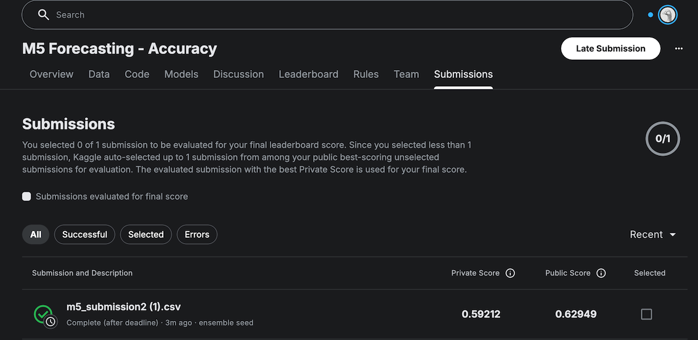

# M5 Sales Forecasting — Retail Demand Prediction at Scale

**A end-to-end machine learning pipeline for 28-day retail demand forecasting**

📍 University of Minnesota · Carlson School of Management · MSBA Program

---

## Executive Summary

This project applies the M5 Forecasting Accuracy competition dataset — 30,490 Walmart product-store time series across California, Texas, and Wisconsin — to build a 28-day demand forecasting pipeline. The workflow covers data cleaning and memory optimization, external data integration, systematic feature engineering experimentation (16 controlled ablations from a 14-feature baseline), multi-model comparison (LightGBM, Random Forest, Ridge Regression, GRU), and two-phase hyperparameter tuning using grid search and Optuna. The final submission is a 3-seed LightGBM ensemble using recursive forecasting, achieving a private leaderboard WRMSSE of **0.59212**.

**Key deliverables:**

- Memory-optimized data pipeline converting wide-format sales history into a long-format modeling dataset
- Systematic feature ablation study across 16 controlled experiments
- Multi-model comparison across four model families
- Two-phase hyperparameter optimization (grid search + Optuna)
- Recursive 28-day ensemble forecast submitted to Kaggle

---

## Results

**Best Kaggle submission:** 3-seed LightGBM ensemble · Private WRMSSE **0.59212** · Public WRMSSE 0.62949


| Model | RMSE | MAE | Notes |
|---|---|---|---|
| **LightGBM (Tuned)** | **2.0025** | **1.011** | Optuna trial 37; 18 features; 152 iterations |
| Random Forest | 2.0802 | 1.032 | n_estimators=300, max_depth=20 |
| Ridge Regression | 2.1180 | 1.051 | alpha=0.5 |
| GRU (RNN) | 2.2584 | 1.149 | seq_len=28, units=32; stopped at epoch 3 |
| LightGBM Baseline (E0) | 2.1619 | 1.017 | 14 features; no tuning |

---

## Repository Structure

```text
.
├── notebooks/
│   ├── 01_data_cleaning_and_preparation.ipynb      # Parse, downcast, melt wide→long, merge tables
│   ├── 02_external_data_integration.ipynb          # Weather & external feature exploration
│   ├── 03_feature_engineering_experiments.ipynb    # 16 controlled FE ablations (E0–E10 + combinations)
│   ├── 04a_model_exploration_rf_ridge.ipynb        # Random Forest & Ridge Regression
│   ├── 04b_model_exploration_gru.ipynb             # GRU (RNN) model
│   ├── 04c_lgbm_hyperparameter_tuning.ipynb        # 2-phase grid search + Optuna tuning
│   ├── 05_final_forecast_submission.ipynb          # 3-seed ensemble, recursive 28-day forecast
│   └── experiments/
│       ├── exp01_baseline_lgbm_pipeline.ipynb      # Initial LightGBM baseline on cleaned data
│       ├── exp02_feature_experiments_E1_E4.ipynb   # Individual ablation tests, feature groups E1–E4
│       └── exp03_feature_experiments_E5_E9.ipynb   # Individual ablation tests, feature groups E5–E9
│
├── results/
│   ├── model_performance_summary.csv
│   ├── experiment_results_summary.csv
│   ├── feature_engineering_table.csv
│   ├── final_model_feature_importance.csv
│   ├── best_lgbm_params.json
│   ├── kaggle_best_score.png
│   └── images/
│       ├── model_comparison.png
│       ├── feature_importance.png
│       └── fe_experiments.png
│
├── docs/
│   ├── presentation.pdf
│   └── project_report.pdf
│
├── data/
│   └── README.md                                   # Kaggle download instructions
│
├── requirements.txt
└── .gitignore
```

---

## 01 — Data Cleaning & Preparation

Ingests three raw Kaggle files and produces a single cleaned long-format parquet that all downstream notebooks consume.

**Type parsing & memory optimization**

Downcasts numeric columns across `sales_train_evaluation.csv`, `sell_prices.csv`, and `calendar.csv` before any joins, reducing memory footprint by ~440 MB. Calendar date strings are parsed to datetime; event NaN fields are filled with `"NoEvent"` (1,807 of 1,969 days have no event).

**Leading-zero detection**

Items not yet on shelf have a streak of leading zeros in their sales history. These rows are flagged as `is_active = 0` to prevent leaking zero demand into training as if it were genuine low-demand signal.

**Wide → long melt**

Converts 1,941 daily sales columns into a single `demand` column, then merges `calendar` and `sell_prices` on date and item-store keys. Output: `cleaned_data/long_df_clean.parquet`.

Key data facts after cleaning:
- **30,490 time series** (3,049 items × 10 stores)
- 1,941 days of history per series
- Millions of daily observations in long format

📓 Notebook: [01\_data\_cleaning\_and\_preparation.ipynb](notebooks/01_data_cleaning_and_preparation.ipynb)

---

## 02 — External Data Integration

Explores whether external signals improve forecast accuracy beyond the internal demand history.

**SNAP & event indicators**

`snap_flag` (whether SNAP benefits are active in the listing's state on a given day) and `is_event` (any holiday or promotional event) are sourced from `calendar.csv`. These are later confirmed as the most impactful additions in the feature engineering experiments.

**Weather data (exploratory)**

Daily temperature records (max/min, z-scores) for California, Texas, and Wisconsin were assembled from public NOAA data and joined to the sales dataset. Weather features produced no meaningful RMSE improvement (delta < 0.0001 vs. baseline) and are **not part of the final model**. The join code is retained for reproducibility.

If reproducing the weather experiment, place `weather.csv` at `data/raw/weather.csv`. Expected columns: `STATION`, `DATE`, `TMIN`, `TMAX`, `PRCP`, `SNOW`.

📓 Notebook: [02\_external\_data\_integration.ipynb](notebooks/02_external_data_integration.ipynb)

---

## 03 — Feature Engineering Experiments

Runs 16 controlled ablation experiments to identify which features improve over the 14-feature baseline, using a consistent train/validation split throughout.

**Baseline features (E0) — 14 total:**

| Group | Features |
|---|---|
| Categorical | `item_id`, `dept_id`, `cat_id`, `store_id`, `state_id` |
| Calendar | `dow`, `month` |
| Price | `sell_price`, `price_change`, `is_promo` |
| Lag & Rolling | `lag_7`, `lag_28`, `rmean_7`, `rmean_28` |

**Experiment results (selected):**

| Experiment | Added Features | RMSE | vs Baseline |
|---|---|---|---|
| E0 — Baseline | — | 2.1619 | — |
| E7 — Event & SNAP | `snap_flag`, `is_event` | 2.1421 | −0.0198 |
| E1 — Demand lag | `lag_56` | 2.1578 | −0.0041 |
| **E7+E1 — Combination ★** | **`snap_flag`, `is_event`, `lag_56`** | **2.1322** | **−0.0297** |
| E9 — All E5~E8 | All price/promo/event/hierarchy | 2.1364 | −0.0255 |
| E2 — Demand lag | `lag_365` | 2.1864 | +0.0245 *(rejected)* |


**Leakage-safety principle:** all lag and rolling features use a minimum shift equal to or beyond the 28-day forecast horizon. `lag_56` is the shortest safe additional lag; `lag_365` introduced too many NaNs at series start and was rejected.

Features tested but not selected: `lag_365` (NaN degradation), price enhancement features (`price_vs_mean`, `price_vs_dept_avg`) (marginal gain, added noise), and weather features (RMSE delta < 0.0001).

📓 Notebook: [03\_feature\_engineering\_experiments.ipynb](notebooks/03_feature_engineering_experiments.ipynb)

---

## 04a — Model Exploration: Random Forest & Ridge Regression

Trains Random Forest and Ridge Regression on the 17-feature E7+E1 feature set as alternative baselines to LightGBM.

**Random Forest** — `n_estimators=300`, `max_depth=20`; RMSE 2.0802, MAE 1.032. Captures non-linear interactions but slower to train than LightGBM and less competitive on tabular time-series data at this scale.

**Ridge Regression** — `alpha=0.5`; RMSE 2.1180, MAE 1.051. Fastest model to train (0.13s); establishes the linear baseline. Performance gap vs. LightGBM confirms non-linear demand patterns dominate.

📓 Notebook: [04a\_model\_exploration\_rf\_ridge.ipynb](notebooks/04a_model_exploration_rf_ridge.ipynb)

---

## 04b — Model Exploration: GRU

Trains a lightweight GRU (Gated Recurrent Unit) model on the E7+E1 feature set to evaluate whether sequence modeling adds value over tree-based methods.

**Architecture** — `seq_len=28`, `units=32`, `dropout=0.10`; trained in Google Colab. Stopped early at epoch 3 (validation loss plateaued). RMSE 2.2584, MAE 1.149 — the weakest of all four model families tested.

The GRU underperforms relative to LightGBM likely because: (1) the feature set already captures most temporal structure via explicit lags and rolling means, leaving little signal for the RNN to extract from raw sequences; and (2) the M5 dataset's sparsity and heterogeneity across 30,490 series makes sequence alignment difficult without item-specific sequence modeling.

📓 Notebook: [04b\_model\_exploration\_gru.ipynb](notebooks/04b_model_exploration_gru.ipynb)

---

## 04c — LightGBM Hyperparameter Tuning

Uses a two-phase search strategy to optimize LightGBM on the 17-feature E7+E1 set, then confirms the best parameters before final training.

**Phase 1 — Grid search** (12 configurations): systematically varies objective function, `tweedie_variance_power`, `num_leaves`, and learning rate to identify which directions help. Best configuration: `set_06_tweedie_low` (RMSE 2.0065), which lowered `tweedie_variance_power` from 1.5 → 1.2.

**Phase 2 — Focused Optuna search** (40 trials): zooms into the Phase 1 winner region with a narrowed search space. Best: trial 37 (RMSE **2.0025**).

Best hyperparameters ([`results/best_lgbm_params.json`](results/best_lgbm_params.json)):

```json
{
  "objective": "tweedie",
  "boosting_type": "gbdt",
  "learning_rate": 0.0419,
  "num_leaves": 91,
  "min_data_in_leaf": 85,
  "tweedie_variance_power": 1.277,
  "lambda_l1": 0.868,
  "lambda_l2": 0.360,
  "feature_fraction": 0.699,
  "bagging_fraction": 0.869,
  "best_iteration": 152
}
```

📓 Notebook: [04c\_lgbm\_hyperparameter\_tuning.ipynb](notebooks/04c_lgbm_hyperparameter_tuning.ipynb)

---

## 05 — Final Forecast Submission

Produces the Kaggle submission using a 3-seed LightGBM ensemble with recursive 28-day forecasting.

**Feature set** — 18 features: the E7+E1 set (17 features) plus `is_active`, added to suppress predicted demand for items not yet on shelf.

**Recursive forecasting** — each of the 28 forecast days is predicted in order. Predicted values are appended to the history so they serve as lag/rolling inputs for subsequent days, mirroring real-world deployment where future demand is unknown at inference time.

**Seed ensemble** — three independent LightGBM models trained with seeds 42, 123, and 2024 (identical hyperparameters). Predictions are averaged to reduce variance, a standard competition technique.

**Submission scope:**
- Forecast period: days 1942–1969 (Kaggle evaluation window)
- Total predictions: 853,720 (30,490 series × 28 days)
- Submission file: 60,980 rows × 28 columns (F1–F28)

**Kaggle result:**



| Metric | Score |
|---|---|
| **Private WRMSSE** | **0.59212** |
| Public WRMSSE | 0.62949 |

📓 Notebook: [05\_final\_forecast\_submission.ipynb](notebooks/05_final_forecast_submission.ipynb)

---

## Experiments

Three exploratory notebooks that preceded the consolidated pipeline. Results from these informed the experiment design in `03_feature_engineering_experiments.ipynb`.

**`exp01_baseline_lgbm_pipeline`** — initial streamlined LightGBM baseline on the cleaned long-format dataset; establishes the reference RMSE before feature experimentation begins.

**`exp02_feature_experiments_E1_E4`** — individual ablation runs for feature groups E1–E4 (demand lags `lag_56`, `lag_365`; rolling stats `rstd_28`, `rmean_56`, `rmax_28`, `rmin_28`; price features `price_vs_mean`, `price_vs_dept_avg`).

**`exp03_feature_experiments_E5_E9`** — individual ablation runs for feature groups E5–E9 (promo indicators `is_price_drop`, `is_price_min_7d`; event/SNAP flags `snap_flag`, `is_event`; hierarchy aggregates `dept_avg_demand`, `store_avg_demand`).

📓 Notebooks: [exp01](notebooks/experiments/exp01_baseline_lgbm_pipeline.ipynb) · [exp02](notebooks/experiments/exp02_feature_experiments_E1_E4.ipynb) · [exp03](notebooks/experiments/exp03_feature_experiments_E5_E9.ipynb)

---

## Setup & Usage

### Prerequisites

- Python 3.10+
- GPU optional (required only for `04b_model_exploration_gru.ipynb` at scale; Colab recommended)

### Environment Setup

```bash
pip install -r requirements.txt
```

### Data Download

Raw data files are not included due to file size (> 500 MB total). See [`data/README.md`](data/README.md) for full instructions.

```bash
pip install kaggle
kaggle competitions download -c m5-forecasting-accuracy
unzip m5-forecasting-accuracy.zip -d data/raw/
```

### Configuration

Each notebook has a configuration cell near the top. Update the path variables before running:

```python
from pathlib import Path

DATA_DIR   = Path("../data/raw")                               # Kaggle raw CSVs
OUTPUT_DIR = Path("./cleaned_data")                            # output of notebook 01
DATA_PATH  = Path("../results/long_df_with_features.parquet")  # output of notebook 03
```

> **Google Colab users:** Uncomment the `drive.mount` cell at the top of each notebook and update paths to your Google Drive locations.

### Recommended Execution Order

```
01 → 02 (optional) → 03 → 04c → 05
```

Notebooks `04a` and `04b` can be run independently after `03` and are not required to reproduce the final submission.

---

## Dataset

**Source:** [Kaggle M5 Forecasting — Accuracy](https://www.kaggle.com/competitions/m5-forecasting-accuracy)

| File | Description | Size |
|---|---|---|
| `sales_train_evaluation.csv` | Daily unit sales — 3,049 items × 1,941 days (wide format) | ~120 MB |
| `sell_prices.csv` | Weekly item sell price per store | ~200 MB |
| `calendar.csv` | Date metadata — day-of-week, SNAP flags, event names | ~100 KB |

---

## Tools & Technologies

| Layer | Technology |
|---|---|
| Data processing | Pandas · NumPy · PyArrow |
| Modeling | LightGBM · scikit-learn · TensorFlow/Keras |
| Hyperparameter tuning | Optuna |
| Utilities | tqdm · matplotlib |

---

## Team

| Member | Contributions |
|---|---|
| Chingfen Hung | Baseline pipeline · Early feature engineering experiments · Final LightGBM fine-tuning |
| Davey Johnson | Data cleaning & preparation · Random Forest · Ridge Regression |
| Ko-Jung Hsu | GRU (RNN) model · External data integration |
| Evelyn Lai | External data integration · Final LightGBM fine-tuning |
| Tzu-Yu Chen | Early feature engineering experiments · Feature engineering (later stage) |

---

## Acknowledgments

- [Kaggle M5 Forecasting — Accuracy](https://www.kaggle.com/competitions/m5-forecasting-accuracy) for the dataset and evaluation framework
- [LightGBM](https://lightgbm.readthedocs.io), [Optuna](https://optuna.org), [TensorFlow/Keras](https://www.tensorflow.org), and [scikit-learn](https://scikit-learn.org) for open-source tooling

---

## Usage and License Note

This repository is shared for academic and portfolio purposes. Please contact the author before reusing or redistributing the code.
